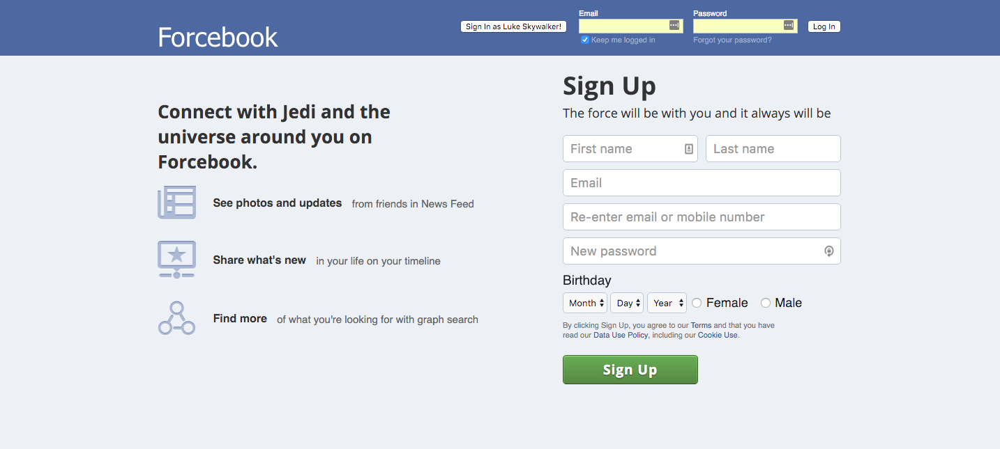

#Forcebook

[Link](http://forcebook.herokuapp.com/home)

##Description
Forcebook is a web application for connecting characters from the Star Wars world. It was inspired by Facebook and built using Ruby on Rails and React on a Flux architecture.

##Log In

##Home

##Profile

##Features
* Sign up/in with email
* Create/Delete posts
* View posts in feed/profile in most recent order
* Send/Accept/Decline friend requests from other users
* Unfriend friends
* Upload images through Cloudinary
* Rails back end, React.js and Flux front end
* Search across multiple attributes and through associations

### To-Do:

* [] Profile and cover photo upload/update
* [] Friend search
* [] Infinite Scroll
* [] Polymorphic comments (comment on comments)
* [] Email confirmation validation
* [] Privacy settings for posts/photos
